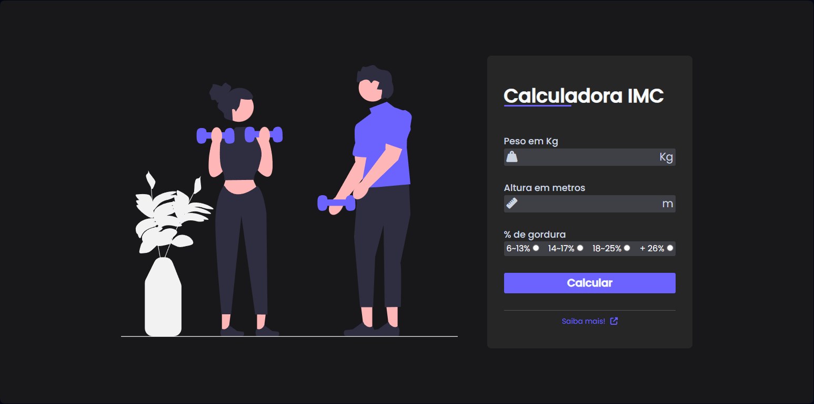

<h1 align="center">Js-BMI_calculator:</h1>

## 📲 View the project here
<a href="https://devgustavus.github.io/Js-BMI_calculator/">https://devgustavus.github.io/Js-BMI_calculator/</a>

## 📖 About the project
In this project, I created a web-based BMI calculator. I implemented a straightforward form with a focus on UI/UX, responsiveness, and various validations. Additionally, I incorporated numerous conditional statements using if and else to analyze the user's input information for BMI. Depending on the input, distinct pop-ups are displayed, providing a tailored user experience.



## 🦾 Technologies used
<div style="display: flex;">
  


</div>

## 🤔 What i learned
- I learned how to create a "pop-up" manually.
- I enhanced the manipulation of "boxes" in the HTML architecture.
- I refined JS features related to UI/UX.

## 👽 How to clone this project

````bash
    # Select where you want to clone
    $ cd ~/Documents/WHERE_YOU_WANT
````

````bash
    # Clone the project
    $ git clone https://github.com/DevGustavus/REPOSITORY_NAME.git
````

````bash
    # Check if cloning worked fine
    $ cd ~/Documents/DIRECTORY_LOCATION
    $ ls
````
